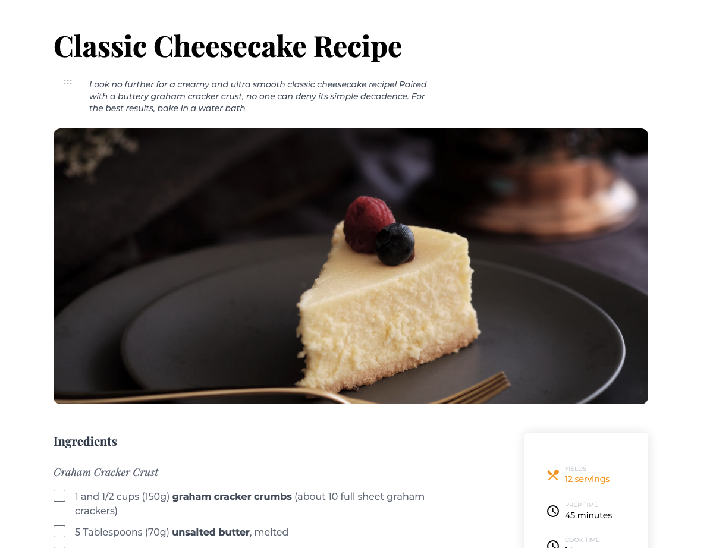

<!-- Please update value in the {}  -->

<h1 align="center">Recipe Page</h1>

<div align="center">
   Solution for a challenge from  <a href="http://devchallenges.io" target="_blank">Devchallenges.io</a>.
</div>

<div align="center">
  <h3>
    <a href="https://cheesecake-recipe-kiyov09.netlify.app">
      Demo
    </a>
    <span> | </span>
    <a href="https://github.com/kiyov09/devchallenges-recipe-page">
      Solution (this repo)
    </a>
    <span> | </span>
    <a href="https://devchallenges.io/challenges/OEKdUZ6xs0h99C38XVht">
      Challenge
    </a>
  </h3>
</div>

<!-- TABLE OF CONTENTS -->

## Table of Contents

- [Overview](#overview)
  - [Built With](#built-with)
- [Features](#features)
- [How to use](#how-to-use)
- [Contact](#contact)
- [Acknowledgements](#acknowledgements)

<!-- OVERVIEW -->

## Overview



This is my solution for the <a href="https://devchallenges.io/challenges/OEKdUZ6xs0h99C38XVht"> Recipe Page </a> challenge from <a href="http://devchallenges.io" target="_blank">Devchallenges.io</a>

### Built With

<!-- This section should list any major frameworks that you built your project using. Here are a few examples.-->

- [Tailwind](https://tailwindcss.com/)
- [Vite](https://vitejs.dev)

## Features

<!-- List the features of your application or follow the template. Don't share the figma file here :) -->

This application/site was created as a submission to a [DevChallenges](https://devchallenges.io/challenges) challenge. The [challenge](https://devchallenges.io/challenges/OEKdUZ6xs0h99C38XVht) was to build an page to complete the following user stories:

- [x] I can see a recipe with ingredients and instructions
- [x] I can select a checkbox if I have the ingredients
- [x] I can see the number of servings, baking times

## How To Use

To clone and run this application, you'll need [Git](https://git-scm.com) and [Node.js](https://nodejs.org/en/download/) (which comes with [npm](http://npmjs.com)) installed on your computer. From your command line:

```bash
# Clone this repository
$ git clone https://github.com/kiyov09/devchallenges-recipe-page

# Install dependencies
$ npm install

# Run the app
$ npm run dev
```

## Contact

- GitHub [@kiyov09](https://github.com/kiyov09)
- Twitter [@kiyov09](https://twitter.com/kiyov09)
